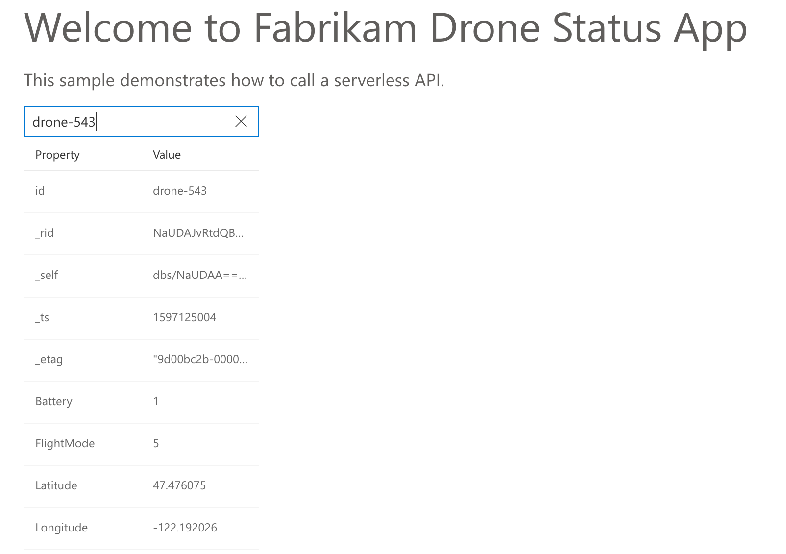

# Deploying a Status Website

In this lab, you will extend the `statusapp` stack to add an HTML frontend application that displays drone status data. You will deploy a static website to a new Storage Account, including the HTML and JavaScipt files.

Make sure you are still in the `statusapp` folder with the same files that you created in Lab 4.

## Step 1 &mdash; Create a Static Web Site

Create a new file called `website.ts` in the same `statusapp` folder where `index.ts` exists. Add the following lines to it:

```ts
import * as azure from "@pulumi/azure";
import { appName, resourceGroupName } from "./common";

export const storageAccount = new azure.storage.Account(`${appName}fe`, {
    resourceGroupName: resourceGroupName,
    tags: {
        displayName: "Drone Front End Storage Account",
    },    
    accountTier: "Standard",
    accountReplicationType: "LRS",
    staticWebsite: {
        indexDocument: "index.html",
        error404Document: "404.html",
    },
});

export const storageAccountUrl = storageAccount.primaryWebEndpoint;
```

You defined yet another Storage Account. This time, it has an extra property `staticWebsite` which makes Azure create a special blob container called `$web`. Any files in that container will be served as a static website.

You also exported the URL that can be used as the website endpoint.

Add an import line and an export line to `index.ts`:

```ts
import * as website from "./website";
export const storageAccountUrl = website.storageAccountUrl;
```

> :white_check_mark: After these changes, your files should [look like this](./code/step1).

## Step 2 &mdash; Download the Files To Local Folder

Download the zip archive from https://mikhailworkshop.blob.core.windows.net/zips/droneapp-noauth.zip.

Extract the contents into the folder `droneapp-noauth` under the folder `statusapp`. Make sure that the HTML and JavaScript files are located directly inside `statusapp/droneapp-noauth` (not in a subfolder below).

These files are a React-basd web application built with Webpack. That's why the file names are a bit odd. `noauth` means there's no authentication built-in yet: you will add authentication in Lab 8.

## Step 3 &mdash; Install Additional NPM Packages

The next step relies of several NPM packages to be present. Run the following command to install the to the `statusapp`:

```
npm install mime node-dir @types/mime @types/node-dir
```

> :white_check_mark: After these changes, your `package.json` file should [look like this](./code/step3/package.json).

## Step 4 &mdash; Add a Function App

Create a new file called `websiteFiles.ts` in the same `statusapp` folder. Add the following lines to it:

```ts
import * as pulumi from "@pulumi/pulumi";
import * as azure from "@pulumi/azure";
import * as website from "./website";
import * as functionApp from "./functionApp";
import * as mime from "mime";
import * as nodedir from "node-dir";
import * as fs from "fs";

const folderName = "droneapp-noauth";
const files = nodedir.files(folderName, { sync: true });
for (const file of files) {
    const name = file.substring(folderName.length+1);
    const contentType = mime.getType(file) || undefined;

    const rawText = fs.readFileSync(file, "utf8").toString();
    const asset = functionApp.functionUrl
        .apply(url => rawText.replace("[API_URL]", url))
        .apply(text => new pulumi.asset.StringAsset(text));

    const myObject = new azure.storage.Blob(name, {
        name,
        storageAccountName: website.storageAccount.name,
        storageContainerName: "$web",
        type: "Block",
        source: asset,
        contentType,
    }, { parent: website.storageAccount });
}
```

Here is what happens in this snippet:

1. You list the files inside the `droneapp-noauth` folder and iterate through them with a `for` loop.
2. You extract the file `name` from the path.
3. You determine the `contentType` of the file.
4. You load the file contents to `rawText`.
5. Some files have a placeholder for the backend URL. In real apps, you'd probably bake this URL at the Webpack build time, but here we simply replace it at deployment time.
6. The placeholder `[API_URL]` is replaced with the URL of the Function App from Lab 4.
7. You deploy the file with the `Blob` resource to the `$web` container of the storage account.

Add an import line to `index.ts`:

```ts
import "./websiteFiles";
```

> :white_check_mark: After these changes, your files should [look like this](./code/step4).

## Step 5 &mdash; Deploy and Test the Stack

Deploy the stack

```bash
$ pulumi up
...
Updating (dev):
     Type                             Name           Status      
 +   pulumi:pulumi:Stack              statusapp-dev  created     
 +   └─ azure:storage:Account         statusfe       created     
 +      ├─ azure:storage:Blob         chunk-map.json created    
...    
 
Outputs:
  + storageAccountUrl: "https://statusfe1267cccd.z6.web.core.windows.net/"

Resources:
    + 21 created
    6 unchanged
```

Navigate to the `storageAccountUrl` in a browser, enter your sample drone name to the search box, and hit Enter. You should be able to see the drone data:



If needed, replace `drone-543` with a name of drone as seen in lab 3.

## Next Steps

Congratulations! :tada: You have successfully provisioned a static website and linked it to the Azure Function backend connected to Azure Cosmos DB.

Next, TODO
