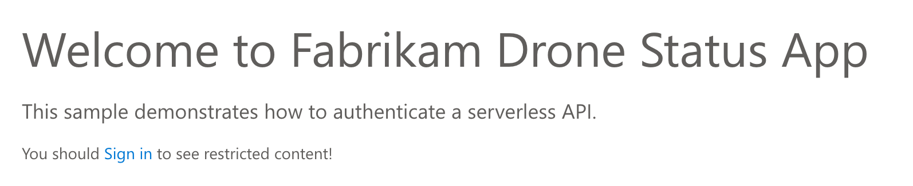

# Lab 8: Enabling User Authentication

Currently, your frontend website is open to anonymous users. In this lab, you will enable Azure Active Directory OAuth2 authentication in the `statusapp` project.

Make sure you are still in the `statusapp` folder with the same files that you created in Labs 4-7.

## Step 1 &mdash; Install AzureAD Provider

Azure Active Directory objects are managed by a separate Pulumi provider called `AzureAD`. Install the provider by running

```bash
npm install @pulumi/azuread
```

## Step 2 &mdash; Add an Azure AD Application

Extend the file `website.ts` with the definition of an Azure AD Application:

```ts
import * as azuread from "@pulumi/azuread";

export const tenantId = pulumi.output(azure.core.getClientConfig()).tenantId;
const apiAppName=`${appName}-api`;

const apiApp = new azuread.Application(apiAppName, {
    name: apiAppName,
    oauth2AllowImplicitFlow: true,
    replyUrls: [storageAccountUrl, cdnUrl],
    identifierUris: [`http://${apiAppName}`],
    appRoles: [{  
        allowedMemberTypes: [ "User" ], 
        description:"Access to device status", 
        displayName:"Get Device Status", 
        isEnabled:true,
        value: "GetStatus",
    }],
    requiredResourceAccesses: [{
        resourceAppId: "00000003-0000-0000-c000-000000000000",
        resourceAccesses: [ { id: "e1fe6dd8-ba31-4d61-89e7-88639da4683d", type: "Scope" } ],
    }],
});
export const applicationId = apiApp.applicationId;
```

Note that it lists URLs of the Storage Account and CDN as well-known reply URLs.

> :white_check_mark: After these changes, your files should [look like this](./code/step2).

## Step 3 &mdash; Adjust the Static Website

Download the zip archive from https://mikhailworkshop.blob.core.windows.net/zips/droneapp-auth.zip. It contains the files for the same static website but with authentication enabled.

Extract the contents into the folder `droneapp-auth` under the folder `statusapp`. Make sure that the HTML and JavaScript files are located directly inside `statusapp/droneapp-auth` (not in a subfolder below).

The source for this application is available [here](https://github.com/mikhailshilkov/azure-serverveless-workshop/tree/master/website/auth).

Open the file `websiteFiles.ts`. Change the name of the folder there:

```ts
const folderName = "droneapp-auth";
```

Also, change the `asset` calculation block to populate the tenant ID, client ID, and application ID inside the static files:

```ts
    const asset = pulumi.all([api.apiUrl, website.tenantId, website.applicationId])
        .apply(([url, tenant, app]) => 
            rawText.replace("[API_URL]", url)
                .replace("[TENANT_ID]", tenant)
                .replace("[APP_ID]", app)
                .replace("[CLIENT_ID]", app))
        .apply(text => new pulumi.asset.StringAsset(text));
```

Now, you should also enforce authentication in the API Management layer. Navigate to `api.ts`, find the `ApiPolicy` resource and insert `validate-jwt` block as below:

```ts
const apiPolicy = new azure.apimanagement.ApiPolicy("policy", {
...
        </cors>
        <validate-jwt header-name="Authorization" failed-validation-httpcode="401" failed-validation-error-message="Unauthorized. Access token is missing or invalid.">
            <openid-config url="https://login.microsoftonline.com/${website.tenantId}/.well-known/openid-configuration" />
            <required-claims><claim name="aud"><value>${website.applicationId}</value></claim></required-claims>
        </validate-jwt>
        <rewrite-uri template="GetStatusFunction?deviceId={deviceid}" />
...
```

> :white_check_mark: After these changes, your files should [look like this](./code/step3).

## Step 4 &mdash; Deploy and Test the Stack

Deploy the stack

```bash
$ pulumi up
...
Updating (dev):
...
Resources:
    + 13 created
    - 12 deleted
    +-8 replaced
    ~ 1 updated
    34 changes. 17 unchanged
```

Navigate to the website in a browser and make sure that you get a login screen like this one:



Note: if you are using the CDN URL, mind that the old files may be served for a while due to caching.

Click the "Sign In" button and login with your Azure username and password, then accept the permission request.

Now, the search screen should appear, and your user account is shown in the top-right corner.

## Next Steps

Congratulations! :tada: You have successfully setup Azure AD authentication for your website.

You have completed the labs! You are awesome! :tada:

After you are done with playing with the application, don't forget to clean up the infrastructure by running `pulumi destroy` in both `statusapp` and `telemetry` projects (in this order).

You will always be able to re-create them, because the infrastructure is defined as code!
